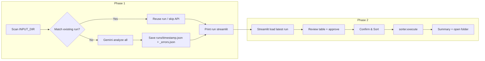

# Receipt Sorter — Two-Phase Gemini + Streamlit

## Summary of your choices

- **Buckets (5):** `receipts_keep` | `receipts_old` | `invoices_docs` | `photos_screenshots` | `unknown`
- **Date:** Receipts on or after `CUTOFF_DATE` → `receipts_keep`; older receipts → `receipts_old`
- **Runs:** One folder `runs/`; one manifest file per run (e.g. `runs/2025-03-10_143022.json`) and one error file per run (e.g. `runs/2025-03-10_143022_errors.json`)
- **Reuse:** Before calling Gemini, check if any existing run's "processed file list" matches current input folder; if match, offer (or use) that run so API isn't called again
- **GUI:** Minimal but useful: see buckets and images, checkboxes, options, useful info (no heavy cost estimate or many bulk actions)
- **Errors:** Stored in same `runs/` folder as a matching error file per run
- **.gitignore:** Everything that shouldn't be in git: `.env`, `runs/`, `images/`, `sorted/`, `__pycache__`, `.venv`, etc.
- **Repo:** README + .gitignore; you run `git init` yourself
- **API key:** From `.env` only (`GEMINI_API_KEY`)

---

## 1. Project layout

```
receipt-sorter/
├── .devcontainer/
│   └── devcontainer.json
├── .env                    # GEMINI_API_KEY (create locally, in .gitignore)
├── .gitignore
├── PLAN.md                 # This plan — in repo so it's available in devcontainer
├── README.md
├── requirements.txt
├── config.py
├── main.py                 # Phase 1: scan, optional reuse, analyze, save to runs/
├── analyzer.py             # Gemini API + classification, 5 buckets + date logic
├── sorter.py               # Move files only after GUI confirm
├── app.py                  # Streamlit Phase 2: load run, review, confirm
└── (no images/ or runs/ or sorted/ in repo — all gitignored)
```

Input/output paths come from config (e.g. `INPUT_DIR = "./images"` or `"./to_process"`); you can set `INPUT_DIR` to `./to_process` in `config.py` if you prefer that name.

---

## 2. Config (`config.py`)

- `INPUT_DIR` — folder to scan (e.g. `"./images"` or `"./to_process"`)
- `OUTPUT_DIR` — e.g. `"./sorted"` (folder structure created on first sort)
- `RUNS_DIR` — e.g. `"./runs"` (all run manifests and error files live here)
- `CUTOFF_DATE` — `"YYYY-MM-DD"`; receipts with date ≥ this → `receipts_keep`, else → `receipts_old`
- `MODEL`, `CONCURRENCY`, `MAX_IMAGE_SIZE_PX` as in your spec
- No `MANIFEST_PATH`; manifest path is derived per run as `RUNS_DIR / {timestamp}.json`

---

## 3. Run storage and reuse

**File naming in `runs/`**

- Manifest: `runs/{YYYY-MM-DD_HHMMSS}.json`
- Errors: `runs/{YYYY-MM-DD_HHMMSS}_errors.json`

**Manifest JSON shape (per run file)**

- Array of image result objects (same as your spec: `filename`, `original_path`, `category`, `date`, `vendor`, `total`, `is_financial`, `delete_candidate`, `confidence`, `notes`, `suggested_folder`, `user_folder`, `approved`).
- Plus run metadata at top level or in a wrapper so we can do reuse:
  - `processed_file_list`: list of relative (or absolute) paths that were analyzed, or
  - `processed_files_hash`: hash of sorted paths (e.g. SHA256 of sorted paths string).

**Reuse logic (Phase 1, `main.py`)**

1. Scan `INPUT_DIR` for supported images; build sorted list of paths (relative to cwd or absolute).
2. Compute a "run signature" (e.g. hash of sorted paths, or store path list in each run and compare).
3. List existing run files in `RUNS_DIR` (e.g. `*.json` excluding `*_errors.json`); for each (or for "latest"), load manifest and compare signature to current file list.
4. If a run exists with **matching** file list:
  - **Option A:** Prompt in console: "Found matching run runs/2025-03-10_143022.json. Reuse? [y/n]".
  - **Option B:** CLI flag: `python main.py --reuse` (reuse if match) vs `python main.py` (always analyze fresh).
  - If user chooses reuse (or `--reuse` and match): skip Gemini, set "current run" to that file, print "Analysis complete (reused). Run: streamlit run app.py to review" and exit.
5. If no match or user says no: run Gemini for all images, save new `runs/{timestamp}.json` and `runs/{timestamp}_errors.json`, then print "Analysis complete. Run: streamlit run app.py to review".

Recommendation: implement **Option A** (prompt) first; add **Option B** (flags) if you want scriptable reuse.

---

## 4. Phase 1 — Analysis (`main.py` + `analyzer.py`)

**main.py**

- Load config and env (e.g. `python-dotenv` for `.env`).
- Ensure `RUNS_DIR` exists.
- Scan `INPUT_DIR` recursively for supported extensions: `.jpg`, `.jpeg`, `.png`, `.webp`, `.heic`, `.tiff`, `.bmp`.
- Run reuse check (above); if reusing, exit after message.
- Otherwise call analyzer for each image (with concurrency and retries), collect results and errors.
- Write `runs/{timestamp}.json` (manifest + run signature) and `runs/{timestamp}_errors.json`.
- Print progress ("Analyzing 47/500…") and at end: "Analysis complete. Run: streamlit run app.py to review" and error count if any.

**analyzer.py**

- Use `google.genai` and `genai.Client(api_key=os.getenv("GEMINI_API_KEY"))`.
- Async: `client.aio.models.generate_content()` with `asyncio.Semaphore(CONCURRENCY)`.
- Image handling: resize longest edge to `MAX_IMAGE_SIZE_PX` (Pillow), HEIC→JPEG in memory (`pillow-heif`), send as `image/jpeg` via `types.Part.from_bytes()` (or equivalent in current SDK).
- Retry up to 3 times on 429/500 with 5s delay.
- Classification prompt: ask for JSON with `category` (receipt | invoice | document | photo | screenshot | unknown), `date`, `vendor`, `total`, `is_financial`, `delete_candidate`, `confidence`, `notes`. Do **not** ask the model for `suggested_folder` in the prompt; compute it in code:
  - If category is receipt and date ≥ CUTOFF_DATE → `receipts_keep`
  - If category is receipt and date < CUTOFF_DATE (or null) → `receipts_old`
  - If category is invoice or document → `invoices_docs`
  - If category is photo or screenshot → `photos_screenshots`
  - Else → `unknown`
- Invalid JSON: try regex extract; if still fail, set `confidence=low`, `category=unknown`, `notes` with parse error.
- Corrupt image: skip, append to in-memory errors list; later write to `runs/{timestamp}_errors.json`.

---

## 5. Phase 2 — Streamlit GUI (`app.py`)

**Launch**

- Default: load the **latest** run from `runs/` (by filename timestamp). Optional: sidebar dropdown or CLI arg to pick another run file.

**Layout**

- Title: "Receipt Sorter — Review & Confirm"
- Sidebar: stats (total images; count per bucket; "X / Y approved" progress).
- Main: filters (category, confidence, "show unapproved only", "show low confidence only"), then editable table.

**Table (e.g. `st.data_editor` or columns + widgets)**

- Columns: Thumbnail (80px), Filename, Category (dropdown: 5 buckets), Suggested folder (dropdown, same 5), Date, Vendor, Total, Confidence (badge: green/orange/red), Notes, Delete candidate (checkbox), Approved (checkbox).
- Prefer showing `user_folder` when set, else `suggested_folder`; user can override via dropdown.

**Interactions**

- Row click or select: show larger image preview + metadata in a panel (right or below).
- Buttons: "Approve all", "Reset approvals" (minimal set; skip "Approve high confidence" if you want to keep it minimal).
- Bottom: "X of Y approved"; green "Confirm & Sort X images" (disabled if 0 approved). On click → confirmation dialog ("This will move X files. Are you sure?") → on confirm call `sorter.execute(...)`, show progress then summary.

**After sort**

- Summary: files moved per folder, any errors, button to open `OUTPUT_DIR` in system file manager (e.g. `os.startfile` on Windows, `subprocess.run(["open", ...])` on macOS, `xdg-open` on Linux).

No token/cost estimate required for minimal GUI.

---

## 6. Sorting (`sorter.py`)

- Entry: `execute(manifest_path_or_data, output_dir, runs_dir)`.
- Only move rows where `approved` is true.
- Destination folder: `user_folder` if set, else `suggested_folder`.
- Create folders under `OUTPUT_DIR`: `receipts_keep`, `receipts_old`, `invoices_docs`, `photos_screenshots`, `unknown`.
- `shutil.move()`; on collision append `_1`, `_2`, etc.
- After completion, save final state to e.g. `runs/{run_id}_sorted_manifest.csv` (or same run folder) and return results dict for GUI (counts per folder, errors).

---

## 7. Dev Container

- **Goal:** "Cmd → Reopen in Container" works.
- **Content:** `.devcontainer/devcontainer.json` using a Python image (e.g. `mcr.microsoft.com/devcontainers/python:3.11`).
- **Extras:** Install `requirements.txt` in Dockerfile or `postCreateCommand` so Streamlit and deps are ready; forward port `8501` for Streamlit.
- **Extensions:** `ms-python.python` (and optionally Pylance) so Python works inside the container.

This gives you one-click "Reopen in Container" and a ready-to-run environment.

---

## 8. .gitignore and README

- **.gitignore:** `.env`, `runs/`, `images/`, `to_process/`, `sorted/`, `__pycache__/`, `*.pyc`, `.venv/`, `.idea/`, etc.
- **README:** Steps: `pip install -r requirements.txt`, add `GEMINI_API_KEY` to `.env`, put images in `INPUT_DIR`, run `python main.py`, then `streamlit run app.py`; brief description of two phases and run reuse. Note that repo is ready for `git init` (you do it).

---

## 9. Flow diagram



---

## 10. Implementation order

**Phase A — Repo, ignore, devcontainer, and plan (do first)**  
So you can open the project in a container and have the plan in-repo for the rest of the work.

1. **Git repo + .gitignore + plan in repo**
  - Initialize project under `receipt-sorter/` (or current workspace).
  - Add **.gitignore** (`.env`, `runs/`, `images/`, `to_process/`, `sorted/`, `__pycache__/`, `*.pyc`, `.venv/`, `.idea/`, etc.).
  - Add **PLAN.md** at project root with the full contents of this plan (so it's in the repo and available when you "Reopen in Container").
  - Add **README.md** with minimal steps: clone/open in container, add `.env`, run instructions, and note that you run `git init` when ready.
2. **Dev container**
  - Add **.devcontainer/devcontainer.json**: Python 3.11 image, install `requirements.txt` (e.g. `postCreateCommand`), forward port 8501, Python extension (and optionally Pylance).
  - Optionally add a **.devcontainer/Dockerfile** if you want to pin base image and install deps in the image.
  - Verify: open folder in VS Code/Cursor → "Reopen in Container" works.

**Phase B — Application (build after Phase A)**

1. **Project scaffold:** `config.py`, `requirements.txt` (no code that runs yet).
2. **analyzer.py:** Image load/resize/HEIC→JPEG, Gemini client, async with semaphore and retries, prompt + JSON parse, bucket logic from category + date.
3. **main.py:** Scan input, run signature + reuse check, loop analyzer, write `runs/{ts}.json` and `runs/{ts}_errors.json`, progress print.
4. **sorter.py:** `execute()`, create folders, move with collision handling, write final manifest CSV and return summary.
5. **app.py:** Load latest run, sidebar stats, filters, data editor table, thumbnails, approve, confirm dialog, call sorter, show summary and "open folder".
6. **README:** Update with full run instructions and `git init` note.

---

## 11. Security note

Do **not** commit your API key. Use only `.env` with `GEMINI_API_KEY=` and add `.env` to `.gitignore`. Rotate the key if it was ever committed or shared publicly.
